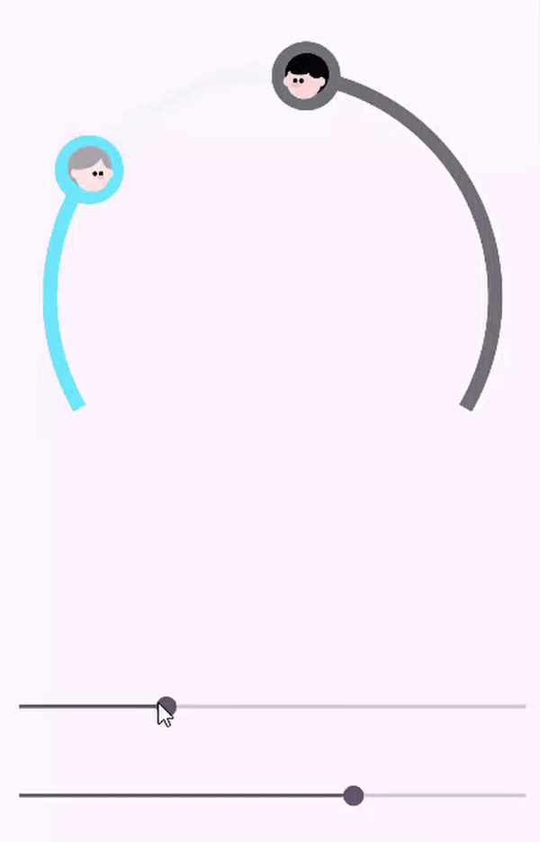
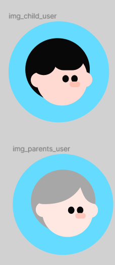
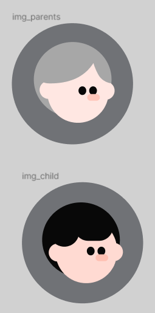

# Motivoo Design Component 🎨
- [Circle ProgressBar](#circle-progressbar)
    - [MotivooPieChart](#motivoopiechart)
    - [MotivooOtherPieChart](#motivoootherpiechart)

## Circle ProgressBar


### MotivooPieChart

- XML Code
```kotlin
<com.android.motivoo_design.MotivooPieChart
    android:id="@+id/custom_view"
    android:layout_width="wrap_content"
    android:layout_height="wrap_content"
    app:layout_constraintBottom_toBottomOf="parent"
    app:layout_constraintEnd_toEndOf="parent"
    app:layout_constraintStart_toStartOf="parent"
    app:layout_constraintTop_toTopOf="parent"
    app:progressBackgroundColor="@color/blue_400_65DBFF" />
```

`app:progressBackgroundColor` : 왼쪽에 위치한 원형 프로그래스 바 백그라운드 색상


- Programmatically Code

```kotlin
binding.customView.userType = Parent // or Child
```


`Parent` : 유저 타입이 부모   
`Child` : 유저 타입이 자식


### MotivooOtherPieChart

- XML Code
```kotlin
<com.android.motivoo_design.MotivooOtherPieChart
    android:id="@+id/custom_view_other"
    android:layout_width="wrap_content"
    android:layout_height="wrap_content"
    app:layout_constraintBottom_toBottomOf="parent"
    app:layout_constraintEnd_toEndOf="parent"
    app:layout_constraintStart_toStartOf="parent"
    app:progressInnerColor="@color/gray_100_F4F5F9"
    app:centerCircleColor="@color/white_FFFFFF"
    app:layout_constraintTop_toTopOf="parent"
    app:progressBackgroundColor="@color/gray_600_707276" />
```
`app:progressInnerColor` : 전체 원형 프로그래스 바 백그라운드 색상

`app:progressBackgroundColor` : 오른쪽에서 올라오는 원형 프로그래스 바 백그라운드 색상

`app:centerCircleColor` : 원형 프로그래스 바 가운데 위치한 원 색상


- Programmatically Code

```kotlin
binding.customViewOther.userType = Child // or Parent
```


`Parent` : 유저 타입이 부모   
`Child` : 유저 타입이 자식